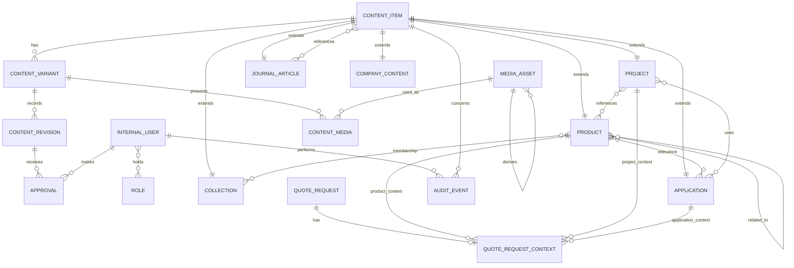

# Database ER Architecture

## 1. Scope and design decision

This is a relational, database-independent ER architecture. It defines candidate entities, keys, constraints, relationships, lifecycle, deletion behavior, and access-pattern indexes. It is not SQL, Prisma, a migration, API, CMS, or implementation specification.

### Content strategy decision: hybrid shared identity

Three options were assessed:

1. Separate type-specific entities with their own translations and approval rules would duplicate multilingual/governance logic.
2. One giant generic content table would obscure type-specific relationships and weaken integrity.
3. **Chosen: hybrid shared identity.** `ContentItem` supplies one stable conceptual identity; `ContentVariant`, `ContentRevision`, `Approval`, lifecycle, and controlled media presentation are shared. Type-specific entities (`Product`, `Collection`, `Application`, `Project`, `JournalArticle`, `CompanyContent`) are one-to-one extensions of `ContentItem`.

This preserves one TR/EN identity, language-specific approval/publication, clear foreign keys, and future type-specific data without inventing unsupported product attributes.

## 2. Identifier and entity strategy

Use UUID primary identifiers consistently for externally safe, distributed creation and stable relationships. Human-readable localized slugs are not primary identifiers and remain subject to final SEO URL policy. Every governed entity has creation/update timestamps; material governance actions also have an actor and timestamp.

`CompanyContent` is a single editorial entity with a constrained conceptual kind: About, Quarry, or Factory. Separate Quarry/Factory tables are unnecessary because no type-specific structured facts are approved.

## 3. ER diagram



The diagram is a summary. The written integrity rules below are authoritative.

## 4. Entity catalog

| Entity | Purpose | PK | Main relationships | Multilingual | Lifecycle | Approval | Public |
|---|---|---|---|---|---|---|---|
| ContentItem | Stable conceptual identity and content type. | UUID | Variants; one type extension; audit | Parent | Aggregate state | Via variants/revisions | Only through eligible variants |
| ContentVariant | One localized public representation. | UUID | ContentItem; revisions; media presentations | One locale | Authoritative localized state | Yes | Per-locale eligibility |
| ContentRevision | Immutable/traceable material version of a variant. | UUID | Variant; approvals; author | Inherits locale | Revision history | Yes | Current approved revision may publish |
| Product | Catalog extension of a Product ContentItem. | ContentItem UUID | Collections, Applications, Projects, Products, inquiries | Via parent | Via parent/variant | Yes | When gate passes |
| Collection | Curated product grouping extension. | ContentItem UUID | Products | Via parent | Via parent/variant | Yes | When published |
| Application | Material-use context extension. | ContentItem UUID | Products, Projects | Via parent | Via parent/variant | Yes | When published |
| Project | Approved reference extension. | ContentItem UUID | Products, Applications, media, inquiries | Via parent | Via parent/variant | Yes | Conditional launch visibility |
| JournalArticle | Editorial extension. | ContentItem UUID | Referenced content items, media | Via parent | Via parent/variant | Yes | When published |
| CompanyContent | About/Quarry/Factory editorial extension. | ContentItem UUID | Media; Products/Journal via references | Via parent | Via parent/variant | Yes | When published |
| MediaAsset | Original or derived image/video/logo asset and rights state. | UUID | Parent/derived asset; ContentMedia | Contextual alt text lives in presentation | Rights lifecycle | Rights verification | Only when eligible |
| ContentMedia | Controlled association/presentation of media on a ContentVariant. | UUID | Variant; MediaAsset | Yes; alt text is localized | Presentation eligibility | Covered by variant approval | When asset + variant eligible |
| Approval | Approval evidence for exact revision, assets, language. | UUID | Revision; Approver | Revision locale | Outcome/history | N/A | Enables eligibility |
| InternalUser | Internal actor identity. | UUID | Roles; approvals; audit | No | Active/inactive policy later | N/A | Not public by default |
| Role | Conceptual responsibility: Author/Editor, Approver, Publisher. | UUID | Users | No | N/A | N/A | No |
| UserRole | Assignment of responsibility to an actor. | UUID | User; Role | No | Assignment lifecycle later | N/A | No |
| QuoteRequest | General or contextual commercial enquiry. | UUID | Optional one context; processing actor/audit | Public copy localized, data not translated | Processing state | Privacy governed | Not public content |
| QuoteRequestContext | Enforces exactly-one allowed contextual target when present. | UUID | QuoteRequest; Product/Project/Application | No | Follows request | N/A | No |
| AuditEvent | Conventional immutable governance trail. | UUID | Actor; concerned ContentItem/variant/revision | No | Historical | N/A | No |

## 5. Multilingual, approval, and lifecycle model

`ContentItem` has exactly one `ContentVariant` per supported locale. For V1, supported public locales are `tr` and `en`; a uniqueness rule prevents a duplicate variant for the same ContentItem and locale. Each variant has a localized slug candidate unique within its locale and content type, subject to final URL policy.

Lifecycle is represented at two levels. `ContentVariant` owns Draft, Approved, Published, Unpublished, Archived, or Permanently Removed because public eligibility is language-specific. `ContentItem` retains an aggregate management state so an entire entity can be archived/removed without losing the distinction between individual variants. An aggregate cannot be publicly active when its required published variants are not eligible.

`ContentRevision` preserves material version history. An `Approval` references one exact revision, its covered associated assets, approving InternalUser, approval outcome, timestamp, and covered locale. A boolean approval flag is insufficient because it loses history and exact version/asset evidence. Publication may target only the currently approved revision of an eligible variant. A material revision or covered-asset change requires renewed approval.

Missing TR or EN normally blocks public publication. A documented language exception is a governance decision recorded with the variant/publication decision; it must not be inferred automatically.

## 6. Catalog and editorial relationships

### Typed relationship choice

All type extensions share `ContentItem`, but catalog relationships use dedicated junction entities rather than an unrestricted polymorphic link. This preserves referential integrity and allows type-specific constraints.

| Relationship entity | Cardinality and meaning | Required / lifecycle effect |
|---|---|---|
| ProductCollection | Product may belong to zero or more Collections; Collection may contain zero or more Products. | Optional; inactive/published visibility requires both ends to be eligible. |
| ProductApplication | Product may be relevant to zero or more Applications; Application may reference zero or more Products. | Optional; relevance must be approved, not inferred. |
| ProjectProduct | Project may reference zero or more Products; Product may be connected to zero or more Projects. | Optional; public only for qualifying published Project. |
| ProjectApplication | Project may reference zero or more Applications and vice versa. | Optional; public only when relevant/approved. |
| RelatedProduct | A Product may point to zero or more other Products. | Optional; prohibit self-reference and duplicate directional relation. |
| JournalContentReference | JournalArticle may reference zero or more eligible Products, Applications, Projects, or CompanyContent. | Optional; controlled target types only; no generic external target. |
| CompanyContentReference | Quarry/Factory/Company content may reference zero or more Products or JournalArticles. | Optional; controlled target types and approved relevance. |

`ProductCollection`, `ProductApplication`, `ProjectProduct`, and `ProjectApplication` require both parent rows to exist. Relationships may be removed without deleting either parent. A relationship must not orphan a type extension, and public discovery queries must exclude relationships whose source, target, variant, rights, approval, or lifecycle is ineligible.

## 7. Media model and association strategy

`MediaAsset` stores the canonical asset identity, media type, source filename/reference, rights state, rights-verification evidence/reference, and optional parent original asset for derived/display assets. A derived asset must reference an original asset; an original asset has no parent. The model supports images, video, thumbnails/previews, gallery assets, and hero media without assuming storage/CDN or product-altering AI transformation.

`ContentMedia` is a controlled junction from a `ContentVariant` to a `MediaAsset`. It carries contextual role (for example primary, gallery, hero, preview), gallery/display order, and language-specific alternative text/caption where needed. It is preferred over direct media foreign keys because media can be authorizedly reused and its presentation differs by content/language. Referential integrity is maintained because both ends are concrete foreign keys; this is not an unrestricted polymorphic association.

Public ContentMedia requires both an eligible published variant and a rights-verified eligible asset. Informative/contextual presentation requires non-empty meaningful alternative text; decorative presentation must use correct empty-alt semantics. One primary media presentation per eligible Product variant is required by the Product publication gate; the exact mechanism enforcing “one primary” is a database constraint plus service validation decision.

## 8. Quote Request integrity model

`QuoteRequest` represents the enquiry and has a processing state, submitted contact/message data necessary for its purpose, submission timestamp, processing responsibility where assigned, and required privacy/consent evidence. Legal basis, recipients, retention, and deletion policy remain open.

`QuoteRequestContext` is optional and one-to-one with QuoteRequest. It has a discriminating context kind: Product, Project, or Application; and three concrete optional foreign-key targets to the corresponding type extensions. A database check constraint must enforce:

```text
General request: no QuoteRequestContext exists.
Product context: exactly product target present; other targets absent.
Project context: exactly project target present; other targets absent.
Application context: exactly application target present; other targets absent.
```

This preserves `0 contexts OR exactly 1 allowed context`, unlike ungoverned nullable foreign keys. Product+Project, Product+Application, Project+Application, or multiple Products cannot be represented. Quote Request context does not assert price, stock, availability, or commitment.

## 9. Governance, actors, and auditability

`InternalUser` is one internal actor identity. `Role` identifies the conceptual responsibilities Author/Editor, Approver, and Publisher; `UserRole` allows one actor to hold multiple responsibilities without conflating actions. The Content Owner / Authorized Company Representative is an Approver responsibility with sole authority over company-specific public content; its real assigned person remains unknown.

`AuditEvent` is a conventional append-only governance history, not event sourcing. It records actor, action type, timestamp, affected governed entity/variant/revision where relevant, and a safe change reference. It must preserve who created, edited, approved, published, unpublished, archived, or removed content. Approval evidence and audit records are retained independently from public content lifecycle, subject to future legal policy.

## 10. Keys, nullability, uniqueness, and foreign keys

### Required versus optional

- ContentItem: stable UUID, type, aggregate state, timestamps are required.
- ContentVariant: parent item, locale, lifecycle state, localized revision relationship, timestamps are required; localized public content values are conditionally required for publication.
- ContentRevision: parent variant, author actor, revision identity/time, and material content snapshot/reference are required.
- Product extension: ContentItem parent is required; technical/commercial attributes are intentionally not defined.
- Project/product/application/collection relationships are optional.
- MediaAsset: identity, type, rights state, and timestamps required; derivative parent conditionally required only for a derived asset.
- ContentMedia: variant, asset, presentation role/order required; alt text conditionally required for informative/contextual use.
- Approval: revision, Approver, outcome, timestamp, and covered language/assets required.
- QuoteRequest: request identity, submission time, processing state, necessary submitted contact/message data, and consent/privacy evidence where legally required; context is optional only through absence/presence of QuoteRequestContext.

### Uniqueness and referential rules

- One ContentVariant per ContentItem + locale.
- One type extension per ContentItem and an extension must match the ContentItem type.
- One QuoteRequestContext per QuoteRequest.
- One actor/role assignment per InternalUser + Role.
- RelatedProduct cannot reference itself and cannot duplicate the same directional pair.
- One Product primary media presentation per public locale/variant; other gallery roles may repeat only where allowed by presentation rules.
- All junction targets must exist; no orphaned variant, revision, approval, presentation, or relationship is permitted.

### Delete behavior

Business content is not physically deleted by default. Active content is unpublished or archived; permanently removed content retains minimal lifecycle/URL-decision/audit trace. A content identity cannot be physically deleted while variants, approvals, media presentations, active relationships, audit records, or legal-retention obligations depend on it.

Removing a relationship detaches only the association. Removing a media presentation detaches it from a variant; a MediaAsset can be physically deleted only when no presentation, derived asset, audit/rights retention, or legal requirement references it. Quote Requests and audit records are not deleted casually; retention/deletion procedures await legal approval.

## 11. Database integrity rules

### Database-enforceable rules

- Stable UUID identity for each entity and required parent-child foreign keys.
- One localized variant per conceptual item and locale.
- Extension type matches ContentItem type.
- Referential integrity for all typed junctions and media presentation.
- Quote Request context is absent or exactly one permitted typed target through one-to-one context plus discriminator/XOR check.
- No self/duplicate RelatedProduct pair.
- Uniqueness of localized slug candidate within its locale/type, pending final URL rules.
- Required lifecycle values and state-valid structural fields.

### Application/service-level rules

- Publication gate: approved current revision, required language condition, description/name, primary media, meaningful alt text, and valid lifecycle.
- Whether a relation is contextually relevant and safe to show publicly.
- Public query filtering across lifecycle, approval, language, media rights, and language exception conditions.
- Project navigation/listing visibility only when at least one qualifying public Project exists.
- Material change detection that triggers re-approval.
- Product data is sourced from the managed database/content layer, never frontend-hardcoded.

### Governance/process rules

- Content Owner approval for company-specific public claims.
- Rights verification before public media use.
- Explicit recorded SEO outcome for former public URLs; no blanket homepage redirects without approval.
- Legal/privacy basis, recipient, retention, and deletion decisions before production quote collection.

## 12. Index strategy

Index only for known access patterns:

- ContentItem type + aggregate lifecycle for management and type discovery.
- ContentVariant parent + locale; locale + publication lifecycle; locale + localized display ordering for catalogue pages.
- Product extension / published eligible variant lookup for 100+ catalogue browsing.
- Each typed junction in both traversal directions for related-content discovery.
- ContentMedia by variant + role/order and MediaAsset by rights state.
- ContentRevision by variant + revision recency; Approval by revision + outcome and Approver + timestamp.
- QuoteRequest processing state + submission time and context target lookups.
- AuditEvent affected entity + timestamp and actor + timestamp.

Exact index syntax and partial-index choices are later PostgreSQL/ORM decisions.

## 13. Traceability

| Database entity/group | Origin |
|---|---|
| ContentItem, ContentVariant, ContentRevision | `02_DOMAIN_MODEL.md` — Conceptual content identity and localization; `01` — Multilingual architecture. |
| Product, Collection, Application and typed catalog junctions | `02` — Catalog domain/relationship analysis; `01` — Product discovery and content relationships. |
| Project, JournalArticle, CompanyContent | `02` — Editorial/company domain; `01` — Projects, Journal, Quarry/Factory architecture. |
| MediaAsset, ContentMedia | `02` — Media domain; `00` — media rights and alternative-text rules. |
| InternalUser, Role, UserRole, Approval, AuditEvent | `02` — Governance domain; `00` — governance/security; `01` — conceptual responsibilities. |
| QuoteRequest, QuoteRequestContext | `02` — Inquiry domain; `01` — V1 quote-context rule; `00` — personal-data rules. |

## 14. Open decisions

### Database-model blocking

None. The ER architecture has a concrete relational integrity strategy for the approved conceptual model.

### Database-model non-blocking

1. Real Content Owner assignment.
2. Legal/privacy retention, deletion, recipient, and jurisdiction requirements for Quote Requests.
3. Which technical/commercial Product attributes and which future browse filters will receive approved content definitions.
4. Whether qualifying Projects exist at launch.

### Later implementation

1. Prisma names, SQL/migration syntax, PostgreSQL-specific checks/indexes, transaction boundaries, connection pooling, and ORM configuration.
2. API serialization, CMS interaction, authentication/session details, audit-log retention mechanics, object storage/CDN, caching, and media processing.
3. Final SEO URL/canonical/redirect/`hreflang` policy and implementation.

## 15. Quality audit

| Check | Result |
|---|---|
| Multilingual identity | Pass: shared ContentItem with unique TR/EN variants; no unrelated language records. |
| Governance | Pass: revision-specific Approval, actor responsibilities, publication eligibility, and auditability are preserved. |
| Media | Pass: controlled concrete junction, localized alt text, ordering, original/derived lineage, and rights gating. |
| Inquiry | Pass: absence or exactly-one typed context has a database integrity strategy. |
| Lifecycle | Pass: variant-aware Draft/Approved/Published/Unpublished/Archived/Removed states remain distinct. |
| Projects | Pass: V1 capability and conditional public visibility are preserved without fictional data. |
| Scope/truthfulness | Pass: no unsupported facts or V1 features are modeled as required. |
| Implementation boundary | Pass: no Prisma, SQL, migration, API, CMS, or frontend implementation is specified. |
